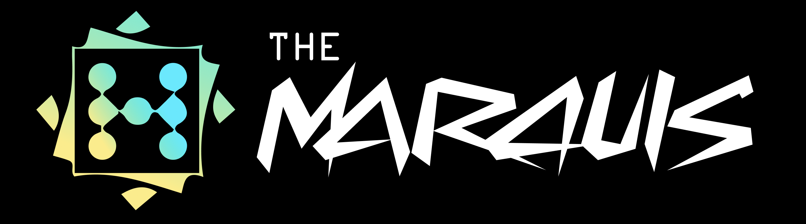

# The Marquis
Multiplayer online board game platform with a focus on games based on random number movements.

* [The Marquis](https://themarquis.xyz)
* [@TheMarquisOnX](https://twitter.com/TheMarquisOnX)
* [The Marquis Blog](https://medium.com/themarquis)
* contact@themarquis.xyz

The Marquis is a next-generation online board game platform that offers an engaging multiplayer experience. Built on Dojo Engine for game logic, with a Next.js landing page and Flutter mobile app, The Marquis provides a seamless gaming experience across devices.

Our platform features various board games such as Ludo, Yahtzee, 6 Nimmt, Lost Cities, and Uckers. Users can utilize our platform's token, stMAR, to host and join online games, while local single-device play remains free.

Key features include:

- Mobile-first design for optimal user experience
- Integration of STRK Token for hosting and joining online games
- Free local play on a single device
- Multiplayer online board games with a focus on "movements based on random numbers"

The Marquis aims to create a fun, interactive, and accessible gaming environment for board game enthusiasts worldwide. Our technology can be applied to various types of board games, potentially expanding into educational games, strategy games, and more.

Download our app:
- [App Store](https://apps.apple.com/us/app/your-app-name/id0000000000)
- [Google Play](https://play.google.com/store/apps/details?id=com.yourcompany.yourapp)

Join us in revolutionizing the online board gaming experience!
